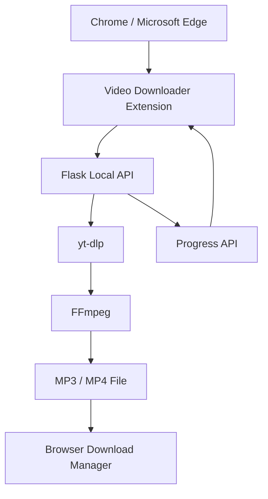

# 🎬 Video Downloader Extension

> A modern Chrome & Microsoft Edge extension for downloading authorized video content in **MP3** or **MP4**, with quality selection, estimated file size, real-time progress tracking, and a clean dark interface.

<p align="center">
  
  
  
  
  
  
</p>

---

## ✨ Overview

**Video Downloader Extension** provides a simple browser interface for analyzing a video URL, selecting an audio or video format, choosing the desired quality, and downloading the resulting file.

The project combines a lightweight **Manifest V3 browser extension** with a local **Flask + yt-dlp + FFmpeg** backend.

> **Current version:** the browser extension communicates with a backend running locally on `127.0.0.1:5000`.

---

## 🚀 Features

* 🎵 Download audio as **MP3**
* 🎥 Download video as **MP4**
* 🎚️ Audio quality: **128 / 192 / 256 / 320 kbps**
* 📺 Smart video quality labels:

  * `360p — SD`
  * `720p — HD`
  * `1080p — Full HD`
  * `1440p — 2K`
  * `2160p — 4K`
* 🖼️ Automatic video thumbnail
* 📝 Video title, channel and duration
* 📦 Estimated file size before download
* 📊 Real-time download progress
* ⚡ Download speed display
* ⏱️ Estimated remaining time
* 🔄 FFmpeg processing status
* 🧹 Automatic temporary-file cleanup
* 🌙 Modern dark interface
* 🔗 Automatic detection of the active video tab
* 💾 Chrome / Edge native download integration
* 🛡️ Improved error handling

---

## 🖥️ Interface

```text
┌─────────────────────────────────────────┐
│ VD  Video Downloader                   │
│     ● Backend connected                │
│                                        │
│ [ Video URL........................ ]  │
│                              Analyze   │
│                                        │
│ ┌────────────────────────────────────┐ │
│ │          VIDEO THUMBNAIL           │ │
│ └────────────────────────────────────┘ │
│                                        │
│ Video title                            │
│ Channel • Duration                     │
│                                        │
│ FORMAT                                 │
│ ┌──────────────┐  ┌──────────────┐    │
│ │ MP3          │  │ MP4          │    │
│ │ Audio        │  │ Video+Audio  │    │
│ └──────────────┘  └──────────────┘    │
│                                        │
│ Quality                                │
│ [ 1080p — Full HD                 ▼ ] │
│                                        │
│ Estimated size                245 MB   │
│                                        │
│ [            Download              ]  │
│                                        │
│ Downloading                     72%   │
│ ███████████████████░░░░░░░░          │
│ 170 MB / 235 MB • 8.4 MB/s • 8 sec   │
└─────────────────────────────────────────┘
```

---

## 🏗️ Architecture



The browser extension handles the user interface while the Python backend performs media analysis, downloading, conversion and file preparation.

---

## 📁 Project Structure

```text
video-downloader-extension/
│
├── extension/
│   ├── manifest.json
│   ├── background.js
│   ├── popup.html
│   ├── popup.css
│   └── popup.js
│
├── templates/
│   └── index.html
│
├── downloads/
│
├── app.py
├── requirements.txt
├── Dockerfile
└── .gitignore
```

---

## ⚙️ Requirements

Before running the project locally, install:

**Python 3.12+**

```powershell
py --version
```

**FFmpeg**

```powershell
ffmpeg -version
```

**Deno**

```powershell
deno --version
```

Deno is used to improve compatibility with modern video extraction workflows.

---

## 📦 Installation

Clone the repository:

```bash
git clone https://github.com/yassineahalmou/video-downloader-extension.git
```

Enter the project:

```bash
cd video-downloader-extension
```

Create a virtual environment:

```powershell
py -m venv .venv
```

Install the dependencies:

```powershell
.\.venv\Scripts\python.exe -m pip install -r requirements.txt
```

Start the backend:

```powershell
.\.venv\Scripts\python.exe app.py
```

The API will be available at:

```text
http://127.0.0.1:5000
```

You can verify it with:

```text
http://127.0.0.1:5000/api/health
```

Expected response:

```json
{
  "message": "Backend connecté",
  "success": true
}
```

---

## 🧩 Install the Browser Extension

### Microsoft Edge

Open:

```text
edge://extensions
```

Enable **Developer mode**, click **Load unpacked**, and select:

```text
video-downloader-extension/extension
```

### Google Chrome

Open:

```text
chrome://extensions
```

Enable **Developer mode**, click **Load unpacked**, and select the same `extension` directory.

Pin **Video Downloader** to the browser toolbar.

---

## 🎯 Usage

1. Start the local backend.
2. Open a supported video page.
3. Click **Video Downloader** in your browser toolbar.
4. The extension can automatically detect the current video URL.
5. Click **Analyze**.
6. Select **MP3** or **MP4**.
7. Choose the desired quality.
8. Check the estimated file size.
9. Click **Download**.
10. Follow the real-time progress until the browser download starts.

---

## 🔌 API

The extension communicates with the Flask backend using several endpoints.

| Endpoint                  | Method | Purpose                            |
| ------------------------- | -----: | ---------------------------------- |
| `/api/health`             |    GET | Check backend availability         |
| `/api/analyze`            |   POST | Analyze video metadata and formats |
| `/api/start-download`     |   POST | Start a download job               |
| `/api/progress/<job_id>`  |    GET | Get real-time job progress         |
| `/download-file/<job_id>` |    GET | Retrieve the finished file         |
| `/api/cleanup/<job_id>`   |   POST | Remove temporary files             |

---

## 🛠️ Technologies

| Technology           | Role                                            |
| -------------------- | ----------------------------------------------- |
| Python               | Backend language                                |
| Flask                | Local REST API                                  |
| yt-dlp               | Media information and download engine           |
| FFmpeg               | Audio/video conversion and merging              |
| Deno                 | JavaScript runtime used by extraction workflows |
| JavaScript           | Extension logic                                 |
| HTML / CSS           | Extension interface                             |
| Manifest V3          | Browser extension platform                      |
| Chrome Downloads API | Final browser download                          |

---

## 🗺️ Roadmap

* [x] Modern dark interface
* [x] MP3 / MP4 selection
* [x] Smart quality detection
* [x] Estimated file size
* [x] Real-time progress bar
* [x] Speed and ETA display
* [x] FFmpeg processing
* [x] Automatic temporary-file cleanup
* [x] Chrome / Edge extension
* [x] Automatic active-tab URL detection
* [ ] Standalone desktop engine
* [ ] Remote backend option
* [ ] Extension store packaging
* [ ] Download history
* [ ] Multiple simultaneous downloads
* [ ] Internationalization
* [ ] Automatic updates

---

## ⚠️ Responsible Use

This project is intended for educational purposes and for downloading content that you own, content for which you have permission, or content whose license explicitly allows downloading.

Users are responsible for complying with applicable copyright laws, platform terms, and content licenses.

---

## 🔐 Privacy

The local version processes requests through a backend running on the user's own computer.

The project does not require a user account and does not intentionally collect personal information.

---

## 🤝 Contributing

Contributions, improvements and bug reports are welcome.

You can fork the repository, create a new branch, implement your changes and submit a pull request.

---

<p align="center">
  Built with Python, Flask, yt-dlp, FFmpeg and JavaScript.
</p>

<p align="center">
  <strong>Video Downloader Extension</strong>
</p>
